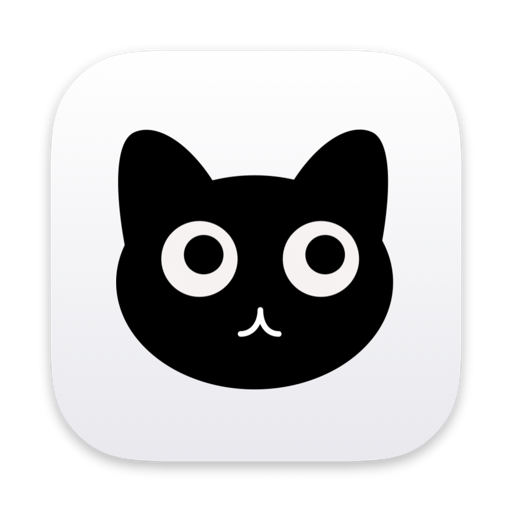
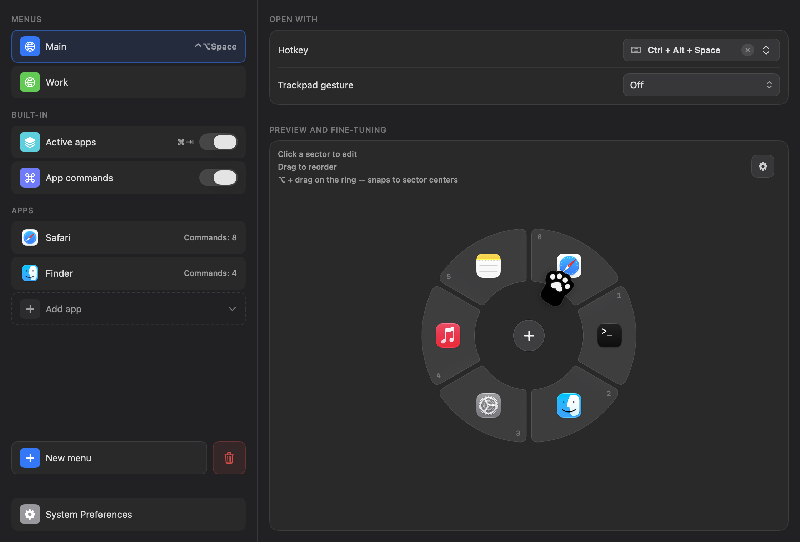
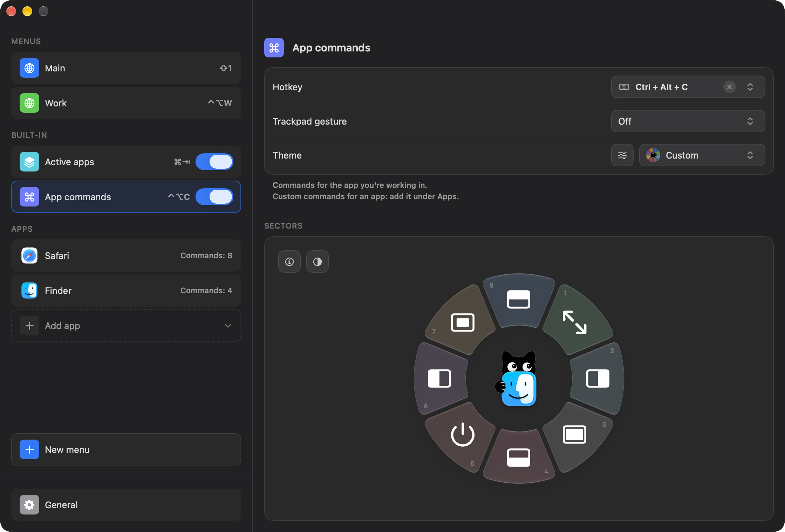

<div align="center">



# CatGrab

**Радиальное меню запуска для macOS.** Нажмите сочетание или коснитесь трекпада, двиньте курсор,
отпустите — откроется программа, сработает сочетание клавиш, команда окна или вставится текст. Без
похода в Dock и поиска по меню.

[](https://github.com/berbekk/CatGrab/actions/workflows/ci.yml)
[](https://github.com/berbekk/CatGrab/releases/latest)
[](#требования)
[](LICENSE)

**[Скачать CatGrab.dmg](https://github.com/berbekk/CatGrab/releases/latest)** · [Сайт](https://berbekk.github.io/CatGrab/) · [English](README.md) · [История изменений](CHANGELOG.md)

<br>



</div>

## Возможности

- **Радиальные меню по сочетанию или касанию трекпада.** У каждого меню своё сочетание — в том числе
  одиночное нажатие <kbd>Fn</kbd>/<kbd>🌐</kbd> — и, по желанию, лёгкое касание трекпада тремя,
  четырьмя или пятью пальцами.
- **Шесть типов действия на сектор:** запустить программу, открыть ссылку, отправить сочетание
  клавиш активной программе, выполнить системное действие (Mission Control, окна программы, быстрая
  заметка, заставка, сон дисплея, блокировка экрана) или положить текст в буфер обмена, чтобы
  вставить его через <kbd>⌘</kbd><kbd>V</kbd>.
- **Активные приложения.** Встроенное кольцо из всех запущенных программ — радиальный
  <kbd>⌘</kbd><kbd>Tab</kbd>, который заодно переключает на нужный рабочий стол и разворачивает
  свёрнутые окна.
- **Команды приложения.** Одно сочетание открывает команды программы, в которой вы работаете: окно
  на половину экрана, развернуть или по центру, полный экран, завершить. Любому приложению можно
  собрать свой набор — хоть из его строки меню, — и то же сочетание покажет команды Figma в Figma и
  команды Xcode в Xcode.
- **Всегда понятно.** Сектор под курсором подписан: название и что он сделает — сайт, сочетание
  клавиш, первые слова текста. У края экрана кольцо целиком остаётся на экране и подтягивает курсор
  к своему центру, так что привычный жест работает где угодно.
- **Быстрый выбор.** Пока меню открыто, нажмите цифру или букву на секторе — или выбирайте
  стрелками, Tab и Return.
- **Иконки откуда угодно:** SF Symbols, эмодзи, фавиконы сайтов, своя картинка или текст.
- **Под себя:** 24 цветовые темы для старта — палитры, градиенты, один цвет, — а дальше тонкая
  настройка цветов, насыщенности, стекла и иконок или свой цвет любому сектору. Размер, поворот и
  кот в центре, который следит глазами за курсором. Настройки — в светлом или тёмном оформлении.
- **13 языков** и резервная копия всех настроек одним JSON-файлом.

<p align="center">
  
</p>

## Установка

1. Скачайте **[CatGrab.dmg](https://github.com/berbekk/CatGrab/releases/latest)**.
2. Откройте его и перетащите **CatGrab** в **Программы**.
3. Запустите **CatGrab** из «Программ».

### Первый запуск

CatGrab бесплатный и с открытым кодом, и он не заверен Apple (для этого нужен платный аккаунт
разработчика). Поэтому при первом запуске macOS попросит подтверждение — один раз:

- **macOS 15 Sequoia и новее:** macOS напишет, что не может проверить CatGrab. Нажмите **Готово**,
  откройте **Системные настройки → Конфиденциальность и безопасность**, пролистайте до строки
  *«CatGrab» заблокирован…* и нажмите **Всё равно открыть**, затем **Открыть**.
- **macOS 13 Ventura и 14 Sonoma:** в «Программах» щёлкните **CatGrab** с зажатой <kbd>Control</kbd>,
  выберите **Открыть** и ещё раз **Открыть**.

<details>
<summary>Удобнее Терминал? Одна команда делает то же самое.</summary>

```bash
xattr -dr com.apple.quarantine /Applications/CatGrab.app
```

Команда снимает с CatGrab (и только с него) отметку «скачано из интернета». После неё CatGrab
открывается как любая другая программа.
</details>

### Доступы

Затем CatGrab попросит два доступа. Нажмите **Открыть системные настройки** и включите **CatGrab** в
каждом:

| Доступ | Зачем |
| --- | --- |
| **Универсальный доступ** | отправка сочетаний клавиш, команды окон и системы, чтение меню активной программы |
| **Мониторинг ввода** | глобальные сочетания, включая <kbd>⌘</kbd><kbd>Tab</kbd> и одиночный <kbd>Fn</kbd> |

Настройки открываются из кота в строке меню или повторным запуском CatGrab из «Программ».

### Требования

macOS 13 Ventura или новее, Apple silicon или Intel.

## Обновление

Скачайте новый DMG, закройте CatGrab (значок в строке меню → Выйти) и перетащите новое приложение
поверх старого. Меню и настройки останутся на месте.

Если после обновления сочетание перестало срабатывать — macOS не узнаёт доступ, выданный прошлой
версии. В **Системные настройки → Конфиденциальность и безопасность** откройте
**Универсальный доступ** и **Мониторинг ввода**, выберите CatGrab, удалите его кнопкой **−**, затем
снова запустите CatGrab и разрешите доступ ещё раз.

## Если что-то не работает

<details>
<summary><b>Сочетание ничего не делает</b></summary>

Проверьте, что CatGrab включён и в **Универсальном доступе**, и в **Мониторинге ввода**
(Системные настройки → Конфиденциальность и безопасность). Если включён, но не срабатывает, удалите
его кнопкой **−** и дайте CatGrab попросить доступ заново — запись от старой версии выглядит
включённой, но уже не действует.
</details>

<details>
<summary><b>В строке меню нет кота</b></summary>

В macOS 26 разрешите его в **Системные настройки → Строка меню → Разрешить в строке меню**. На
MacBook с вырезом значок может оказаться под вырезом, если строка меню заполнена. CatGrab замечает
оба случая и показывает подсказку в настройках; открыть их можно повторным запуском CatGrab из
«Программ».
</details>

<details>
<summary><b>macOS пишет, что CatGrab повреждён или не может быть открыт</b></summary>

Это отметка о скачивании, а не поломка. Выполните команду из раздела [Первый запуск](#первый-запуск)
и снова откройте CatGrab.
</details>

<details>
<summary><b>Удаление</b></summary>

Закройте CatGrab, перенесите его из «Программ» в Корзину и удалите настройки и доступы:

```bash
rm -rf ~/Library/Application\ Support/CatGrab ~/Library/Caches/CatGrab
defaults delete io.github.berbekk.CatGrab
tccutil reset All io.github.berbekk.CatGrab
```
</details>

Не помогло? [Напишите в issues](https://github.com/berbekk/CatGrab/issues/new/choose) — укажите
версию macOS и что уже пробовали.

## Приватность

Всё хранится на вашем Mac, в `~/Library/Application Support/CatGrab/config.json`. Нет аккаунта,
телеметрии и аналитики — об этом заявлено в [манифесте приватности](Sources/CatGrab/PrivacyInfo.xcprivacy).

Единственный сетевой запрос: когда вы выбираете **фавикон сайта** как иконку, CatGrab получает её у
сервисов Google и DuckDuckGo или у самого сайта и кэширует. В запросе передаётся введённый вами
домен. Больше ничего с компьютера не уходит.

## Сборка из исходников

Нужен Xcode 26 или новее — или только его Command Line Tools (`xcode-select --install`). Собранное
приложение работает на macOS 13+.

```bash
git clone https://github.com/berbekk/CatGrab.git
cd CatGrab
make install   # собрать и скопировать CatGrab.app в /Applications
```

`make build` собирает в `build/` без установки, `make test` запускает тесты. Устройство проекта и
как не выдавать доступы заново после каждой пересборки — в [CONTRIBUTING.md](CONTRIBUTING.md),
выпуск релиза — в [RELEASING.md](RELEASING.md).

## Автор

Сделал **Кудряш Василий** — [Telegram](https://t.me/berbekk) · [GitHub](https://github.com/berbekk).
Вопросы, идеи и ошибки — в [issues](https://github.com/berbekk/CatGrab/issues/new/choose).

## Лицензия

[MIT](LICENSE)
